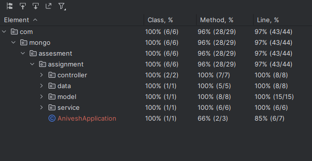

# mongo-db-assignment

To run this Application Please note:

1. You should have compatible Java Version 17 and above
2. There should exist a Mongo-DB database "mydb"
3. There should exist a Mongo-db collection "users"

To run the Application, click run on your local machine and Open the below link
"http://localhost:8080/swagger-ui.html#/"

The Test Cases are written and executed and Current Test Coverage: 97%

Please feel free to ping me in case of any doubts. 

Please do send me the comments in cases of any feedbacks.